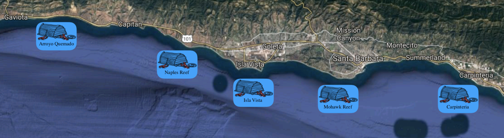

```{r setup, include=FALSE}
knitr::opts_chunk$set(echo = TRUE)
```

```{r echo = FALSE, include = FALSE}

# load packages

library(tidyverse)
library(pwr)
library(kableExtra)
library(RColorBrewer)
library(car)
library(vcdExtra)
# load lobster datasets 

lobster_size <- read_csv("lobster_size_abundance.csv")
lobster_traps <- read_csv("lobster_traps.csv")

# fix the lobster size data: select relevant columns, get rid of the -99999 entries, where data was not recorded/available.  

lobster_size_tidied <- lobster_size %>% 
  select(YEAR, MONTH, SITE, SIZE, COUNT) %>% 
  filter(SIZE != "-99999") # if the size is -9999, it is not included in our new dataset.

#expand so that each lobster has its own row

lobster_expand <- expand.dft(data.frame(lobster_size_tidied), freq="COUNT")

# fix the lobster traps data into a slightly more manageable data frame
lobster_traps_tidied <- lobster_traps %>% 
  select(YEAR,MONTH,SITE,TRAPS) %>% 
   filter(SITE == "AQUE" | SITE == "NAPL" | SITE == "MOHK" | SITE == "IVEE" | SITE == "CARP")

```

##Introduction## 

The California Spiny Lobster, Panulirus interruptus, is a marine crustacean found along the coast from Point Conception in Santa Barbara County to the US-Mexican border.$^3$ Lobster fishing in this area has a deep history and continues today. The spiny lobster is the only invertebrate in California that is subject to both a significant recreational and commercial fishery.$^1$ In an effort to study and understand the impacts of human activities on coastal ecosystems, Santa Barbara Coastal Long Term Ecological Research conducted a study on the California Spiny Lobster.$^6$ Data including lobster abundance and size was gathered at various giant kelp forest ecosystems sites along the southern California coast. 

Lobster abundance is simply measured as a count. In the Long Term Ecological Research study, lobster abundance and size were both measured. Abundance can be affected by a multitude of factors, including predation. The spiny lobster is prey for various marine species including giant sea bass, California sheephead, cabezon, horn shark, leopard shark, octopus and sea otter.$^2$ Humans are also predators and have been catching lobsters for hundreds of years. 
Documented lobster fishing in the region between Santa Barbara County and the US-Mexican border has been recorded since the late 1800s.$^1$ By the 1900s, lobster counts were decreasing significantly. Preliminary measures were enacted to limit rapid decline in population due to human forces. These regulations included seasonal fishing and size limits for catch.$^1$ 
Size limitations are still enforced. 

Lobster size is an important ecological factor. The body length of the lobster larva is about 1.4 mm at at the first stage of its development and about 29 mm at the final larva development stage.$^7$ This measurement is taken along the anterior body segment, or carapace, from the edge of the eye socket to the rear edge of the carapace.$^2$ Once a juvenile hatches, carapace length increases about 3.1 mm after each molt (shedding of the old exoskeleton).$^7$ Juveniles reach approximately 24 mm after 1 year and 44 mm after 2 years. A length of 82.6 mm is expected after sexual maturity, at approximately 7 to 10 years.$^7$ This 82.6 mm value has been established as the legal limit for lobster catch. Once lobsters have reached this size, fishermen can keep the lobster, whereas any smaller lobsters must be released back to the ocean. The minimum size limit was established with the intent to allow each lobster to reproduce at least once before it is captured.$^2$ In the Santa Barbara Coastal Long Term Ecological Research study, a range of carapace sizes were observed in various sites.$^5$ 

Multiple sites were defined and observed in the Santa Barbara Long Term Ecological Research study involving the California Spiny Lobster. Our analysis focuses on five of the sites: Arroyo Quemado (AQUE), Naples Reef (NAPL), Mohawk Reef (MOHK), Isla Vista (IVEE), Carpinteria (CARP). Lobster size and abundance was observed and recorded at each of the sites from 2012-08-20 to 2017-08-25 (5). Two of the sites, Naples and Isla Vista, are located in the California Fish and Game Network of Marine Protected Areas (MPA).$^5$ MPAs are defined marine or estuarine areas designed to protect or conserve marine life and habitat. According to NOAA’s MPA inventory database, Naples’ primary conservation focus is natural heritage. Commercial and recreational fishing are restricted year round. The Isla Vista site is listed as Campus Point State Marine Conservation Area in the NOAA database. The protection focus is the ecosystem, and commercial and recreational fishing are also restricted year round.$^4$ Major revisions and additions to Southern California MPAs went into effect in state waters on January 1, 2012. Both Naples and Isla Vista were established as MPAs on this date. 

##Data and Methods##

Data was provided from the SBC LTER: Reef: Abundance, size and fishing effort for California Spiny Lobster from years 2012 to 2017. Fishing pressure was determined through counted number of fishing trap floats recorded in five locations(Isla Vista, Naples, Arroyo Quemado, Mohawk Reef, and Carpinteria) two of which are designated Marine Protected Areas (Isla Vista and Naples). Observations were collected every 2 to 4 weeks during lobster fishing season (October to March). Abundance and size data was recorded annually by divers in the months immediately prior to the start of lobster fishing season.



Lobster abundance (measured by counts of individuals) fishing pressure (measured by number of trap buoys) and lobster size (measured by mean carapace length) were analyzed to determine trends and significant differences across the 5 locations. The state of California’s South Coast Supplemental Fishing Report on Spiny Lobster was used to compare impacts of fishing pressure in MPA and non-MPA locations before and after their implementation in 2012. Data analysis and visualizations were performed in R-Studio statistical software (v. 1.1.456), Microsoft Word (v. 16.18), and Preview (v. 10.1).

```{r echo = FALSE, include = FALSE}

# 1. Lobster abundance and fishing pressure (2012 - 2017)
# Describe trends in lobster abundance (counts) and fishing pressure (trap buoys) at the five locations from 2012 - 2017. Ignore transect information - we are only interested in evaluating abundance and pressure on the order of SITE. Note: you are not expected to use regression here - just think of ways to clearly describe annual totals visually and in text, noting important trends, events and differences.

########## Exploring trends in lobster counts and traps between sites##########
# summary table of some statistics by site called sites_sizes for the whole range 2012-2017

#exploring total counts per year, not separated out by site. 

sites_sizes <- lobster_expand %>% 
  group_by(YEAR) %>% 
  summarize(count=n())
sites_sizes

# summary of trap data - for each year, all sites. 
site_traps <- lobster_traps_tidied %>% 
  group_by(YEAR) %>%
  summarize(total= sum(TRAPS))
site_traps

##join the two newly created dataframes together

lobster_join <- full_join(sites_sizes,site_traps, by= "YEAR") %>% 
  rename("total_traps"="total",
         "lobster_count"="count")
lobster_join

#### visualizing lobster abundance over time (2012-2017), by site. Now dataframes are broken down by year AND by site. 

lobster_abundance_summary <- lobster_expand %>%
  group_by(YEAR, SITE) %>% 
  summarize("count"=n())
  

lobster_abundance_plot <- ggplot(lobster_abundance_summary, aes(x=YEAR,y=count))+
  geom_line(aes())+
  facet_wrap(~SITE)
lobster_abundance_plot

#### visualizing lobster trap pressure over time 2012-2017 (number of traps). Now incorporating site component. how many traps per site in each year. 

lobster_trap_summary <- lobster_traps_tidied %>%
  group_by(YEAR, SITE) %>% 
  summarize("count"=n())

lobster_trap_plot <- ggplot(lobster_trap_summary, aes(x=YEAR,y=count))+
  geom_line(aes())
lobster_trap_plot

# THIS IS COOL cause it shows a really direct relationship between lobsters and number of traps...
# AND NOW to explore the data by site

# joining the two summary tables of lobster abundance and traps

size_abundance_join <- full_join(lobster_abundance_summary, lobster_trap_summary, by=c("YEAR","SITE")) %>% 
   rename("lobster_count"="count.x",
         "trap_count"="count.y")


```

##Results and Discussion##

####*Trends in Lobster Abundance and Fishing Pressure between 2012 and 2017*####

Trends in lobster abundance were compared against trends in fishing pressure and appear to be inversely related. When fishing pressure decreased, lobster abundance increased. This is reasonable to assume given fishing by its very nature removes individuals from the populations studied and therefore decreases measurements of abundance. The most notable differences were observed at Carpinteria and Isla Vista. This can be attributed to a 37.5% decrease in fishing pressure at both locations from 2016-2017 which allowed populations to more than triple.

```{r include = TRUE, echo = FALSE, fig.align = "center", fig.cap = "**Figure 2. Impact of Fishing Pressure on Spiny Lobster Abundance Across All Locations** Blue lines indicate populations abundance in number of Spiny Lobsters (Panulirus Interruptus) and grey lines represent fishing pressure as measured by number of fishing trap floats counted. Results are from years 2012 through 2017"}
### trying to visualize abundance AND trap pressure on one graph.... not sure if this is actually that useful blah. back to the dataframe that does not separate by site. (lobster_join)

lobster_abundance_trap_plot <- ggplot(lobster_join) + 
  geom_line(aes(x=YEAR,y=lobster_count, color="Lobsters")) +
  geom_line(aes(x=YEAR,y=total_traps, color="Traps")) +
  labs(color="Legend")+
  theme(panel.grid.major = element_blank(),
      panel.grid.minor = element_blank(), 
      panel.background = element_blank(),
      axis.line = element_line(colour = "black")) +
   labs(x = "Year",
       y = "Counts of Traps and Lobsters")

lobster_abundance_trap_plot
```


```{r include = TRUE, echo = FALSE, fig.align = "center", fig.cap="**Figure 3. Impact of Fishing Pressure on Spiny Lobster Abundance Specific to Each Location** Blue lines indicate populations abundance in number of Spiny Lobsters (Panulirus Interruptus) and grey lines represent fishing pressure as measured by number of fishing trap floats counted. Results are from years 2012 through 2017."}
# Can I make these into facet_wrapped line graphs? 
abundance_trap_sites_plot <- ggplot(size_abundance_join, show.legend=TRUE) + 
  geom_line(aes(x=YEAR,y=lobster_count, color="Lobsters")) +
  geom_line(aes(x=YEAR,y=trap_count, color="Traps"))+
  labs(color="Legend")+
   theme(panel.grid.major = element_blank(),
      panel.grid.minor = element_blank(), 
      panel.background = element_blank(),
      axis.line = element_line(colour = "black"))+
  facet_wrap(~SITE)+
  labs(x = "Year",
       y = "Counts of Traps and Lobsters")
abundance_trap_sites_plot

```

####*Trends in Mean Lobster Size*####

Mean carapace length (mm) of Spiny Lobsters differed significantly accross the 5 sites studied for the year 2017 (one-way ANOVA, F(4, 1663) = 3.42, *p* = 0.009, $\alpha$ = 0.05). Post-hoc analysis with Tukey's HSD ($\alpha$ = 0.05) revealed that the Naples location differed significantly with Carpinteria and Isla Vista (pairwise *p* = 0.023, and pairwise *p* = 0.004, respectively). This is consistent with the marked decrease in fishing pressure prior to 2017 in Carpinteria and Isla Vista compared to Naples where population abundance and fishing pressure remained relatively flat. The goal of supporting population growth by limiting fishing appears to be supported by this data.

```{r echo = FALSE, include = TRUE, fig.align = "center", fig.cap = "**Figure 3. Mean Lobster Size by Location** Observations of mean Spiny Lobster size as measured by carapace length (millimeters) accross all 5 locations studied for the year 2017. Lower and upper boundaries of boxes represent 25th and 75th percentiles, respectively. Whiskers represented are 1.5x the interquartile range. Points indicate outliers."}

# 2. Compare mean lobster size by site in 2017
# Compare mean lobster sizes (carapace length (mm)) across the five sites for lobster observations collected in 2017. 

# Exploring the lobster sizes by site
lobster_expand_2017 <- lobster_expand %>% 
    filter(YEAR == "2017")

size_boxplot <- ggplot(lobster_expand_2017, aes(x = SITE, y = SIZE)) +
  geom_boxplot(aes(fill = SITE)) +
  theme(panel.grid.major = element_blank(),
      panel.grid.minor = element_blank(), 
      panel.background = element_blank(),
      axis.line = element_line(colour = "black")) +
  labs(x = "Site Names",
       y = "Carapace Length (mm)") +
       theme(legend.position = "none") +
  scale_fill_brewer()
size_boxplot


# They LOOK really similar. This feels like a job for... ANOVA!


```

```{r echo = FALSE, include = FALSE}
# THE ANOVA TEST
# - Independent observations
# - Equal variances (Levene's test)
# - Normality (histograms and qq plots)
# Only after exploring these things can we decide whether or not an ANOVA is appropriate to test these means. 

lobster_size_qq <- ggplot(lobster_expand_2017, aes(sample=SIZE))+
  geom_qq() +
  facet_wrap(~SITE)
lobster_size_qq

lobster_size_hist <- ggplot(lobster_expand_2017, aes(x=SIZE)) +
  geom_histogram() +
  facet_wrap(~SITE)
lobster_size_hist

# Test for equal variances
# If the largest sample variance is less than 4x greater than the smallest sample variance, then these are close enough to consider variances equal (an ANOVA is robust enough for this)

variances <- lobster_expand_2017 %>% 
  group_by(SITE) %>% 
  summarize(
    variance=var(SIZE)
  )
variances
# The largest variance is not more than 4x greater than the smallest variance! Yay

# YAY now we can ANOVA
# H0: the means across all groups are equal
# H1: the means between at least two groups are different

lobster_size_2017_aov <- aov(SIZE ~ SITE, data= lobster_expand_2017)
summary(lobster_size_2017_aov)

# p=0.0085.... interesting
# So which ones are different, then?!?!
# Tukeys HSD

lobster_size_2017_ph <- TukeyHSD(lobster_size_2017_aov  )
lobster_size_2017_ph

# sig differences between NAPL-CARP, NAPL-IVEE at alpha=.05
```

####*Impact of MPA Status On Spiny Lobster Size*####

One MPA site and one non-MPA site experienced a significant difference in Spiny Lobster size as measured by mean carapace length in millimeters (Table 1 and Table 2, respectively). All Spiny Lobster populations experienced growth over the 5 year period with the exception of those sampled from Carpinteria and Mohawk Reef who showed diminishing average size by 2.13 mm and 5.25 mm, respectively.  
```{r echo = FALSE, include = FALSE}

# 3. Changes in lobster size at MPA and non-MPA sites (comparing only 2012 and 2017 sizes)
# From the data description (http://sbc.lternet.edu/cgi-bin/showDataset.cgi?docid=knb-lter-sbc.77):
# “Data on abundance, size and fishing pressure of California spiny lobster (Panulirus interruptus) are collected along the mainland coast of the Santa Barbara Channel. Spiny lobsters are an important predator in giant kelp forests off southern California. Two SBC LTER study reefs are located in or near the California Fish and Game Network of Marine Protected Areas (MPA), Naples and Isla Vista, both established as MPAs on 2012-01-01. MPAs provide a unique opportunity to investigate the effects of fishing on kelp forest community dynamics. Sampling began in 2012 and is ongoing.”
# At Isla Vista and Naples Reef, the two protected MPA sites (with zero fishing pressure), how do lobster sizes in 2012 and 2017 compare? At the non-MPA sites?


# New df looking at MPAs
MPA_sizes <- lobster_expand %>% 
  mutate(MPA= case_when(.$SITE== "IVEE" | .$SITE =="NAPL"~ "Y",
                        TRUE~ "N"))

# t-test craziness-- comparing 2012 to 2017 mean carapace size at each of the 5 sites

# but first, checking for normality/generally looking at the data

lobster_expand_2012 <- lobster_expand %>% 
    filter(YEAR == "2012") 

lobster_size_2012_qq <- ggplot(lobster_expand_2012, aes(sample=SIZE))+
  geom_qq() +
  facet_wrap(~SITE)
lobster_size_2012_qq

lobster_size_2012_hist <- ggplot(lobster_expand_2012, aes(x=SIZE)) +
  geom_histogram() +
  facet_wrap(~SITE)
lobster_size_2012_hist

# Ok, they're mostly normal-ish (except for the one with 6 data points, so yikes!)
# Now for some t-tests!
# CARP, IVEE, AQUE, MOHK, NAPL


#create new carp dataframes
carp_2012 <- lobster_expand_2012 %>% 
  filter (SITE =="CARP")
carp_2017 <- lobster_expand_2017 %>% 
  filter (SITE =="CARP")
#check for equal variance
CARP_f_test <- var.test(carp_2012$SIZE, carp_2017$SIZE)
CARP_f_test
#variances are equal! run t.test with va.equal=TRUE
CARP_size_t <- t.test (lobster_expand_2012$SIZE, lobster_expand_2017$SIZE, var.equal=TRUE)
CARP_size_t
#p=0.07794

#create new IVEE dataframes
ivee_2012 <- lobster_expand_2012 %>% 
  filter (SITE =="IVEE")
ivee_2017 <- lobster_expand_2017 %>% 
  filter (SITE =="IVEE")
#check for equal variance
IVEE_f_test <- var.test(ivee_2012$SIZE,ivee_2017$SIZE)
IVEE_f_test
#variances are equal! run t.test with va.equal=TRUE
IVEE_size_t <- t.test (ivee_2012$SIZE, ivee_2017$SIZE, var.equal=TRUE)
IVEE_size_t
# p= 0.0599

#create new AQUE dataframes
aque_2012 <- lobster_expand_2012 %>% 
  filter (SITE =="AQUE")
aque_2017 <- lobster_expand_2017 %>% 
  filter (SITE =="AQUE")
#check for equal variance
AQUE_f_test <- var.test(aque_2012$SIZE,aque_2017$SIZE)
AQUE_f_test
#variances are equal! run t.test with va.equal=TRUE
AQUE_size_t <- t.test (aque_2012$SIZE, aque_2017$SIZE, var.equal=TRUE)
AQUE_size_t
#p=0.2097

#create new MOHK dataframes
mohk_2012 <- lobster_expand_2012 %>% 
  filter (SITE =="MOHK")
mohk_2017 <- lobster_expand_2017 %>% 
  filter (SITE =="MOHK")
#check for equal variance
MOHK_f_test <- var.test(mohk_2012$SIZE,mohk_2017$SIZE)
MOHK_f_test
#variances are equal! run t.test with va.equal=TRUE
MOHK_size_t <- t.test (mohk_2012$SIZE, mohk_2017$SIZE, var.equal=TRUE)
MOHK_size_t
#p< 0.001 

napl_2012 <- lobster_expand_2012 %>% 
  filter (SITE =="NAPL")
napl_2017 <- lobster_expand_2017 %>% 
  filter (SITE =="NAPL")
#check for equal variance
NAPL_f_test <- var.test(napl_2012$SIZE,napl_2017$SIZE)
NAPL_f_test
#variances are equal! run t.test with va.equal=TRUE
NAPL_size_t <- t.test (napl_2012$SIZE, napl_2017$SIZE, var.equal=TRUE)
NAPL_size_t
#p=0.5002

```
**Table 1: Comparisons of Mean Lobster Size in 2012 and 2017 at MPA Sites** Spiny Lobster sizes (carapace length in mm) at Isla Vista showed a significant difference between 2012 and 2017 based on a two-sample Student's t-test (t(`r round(IVEE_size_t$parameter, digits = 2)`) = `r round(IVEE_size_t$statistic, digits = 2)`, *p* = `r round(IVEE_size_t$p.value, digits = 2)`, $\alpha$ = 0.05), whereas Spiny Lobsters at the Naples location did not show a significant difference between 2012 and 2017 based on a two-sample Student's t-test (t(`r round(NAPL_size_t$parameter, digits = 2)`) = `r round(NAPL_size_t$statistic, digits = 2)`, *p* = `r round(NAPL_size_t$p.value, digits = 2)`, $\alpha$ = 0.05).

```{r echo = FALSE, include = TRUE}
### Creating a new data frame to be used in a table for number 3 highlighting only MPA sites
mpa_summary <- lobster_expand %>% 
  filter(YEAR == "2012" | YEAR == "2017") %>% 
  filter(SITE == "IVEE" | SITE == "NAPL") %>% 
  select("YEAR", "SITE", "SIZE") %>% 
  group_by(SITE, YEAR) %>% 
  summarize(mean = round(mean(SIZE), 2),
            sd = round(sd(SIZE), 2))

kable(mpa_summary, col.names = c("Site",
                        "Year",
                        "Mean Carapace Length (mm)",
                        "Standard Deviation (mm)")) %>% 
        # Alternating colors with appropriate table width and a 'hover' feature for html viewers
        kable_styling(bootstrap_option = c("striped", "hover"), full_width = FALSE) %>% 
  # Make the site column bold
  column_spec(1:1, bold = T) %>% 
  # Make the row blue for the month with highest mean chlorophyll concentration
  row_spec(1:2, bold = T, color = "blue")
```

**Table 2: Comparisons of Mean Lobster Size in 2012 and 2017 at non-MPA Sites** Spiny Lobster sizes (carapace length in mm) at at Mohawk Reef showed a significant differences between 2012 and 2017 based on a two-sample Student's t-test (t(`r round(MOHK_size_t$parameter, digits = 2)`) = `r round(MOHK_size_t$statistic, digits = 2)`, *p* = `r round(MOHK_size_t$p.value, digits = 2)`, $\alpha$ = 0.05)].

```{r echo = FALSE, include = TRUE}
### Creating a new data frame to be used in a table for number 3 highlighting only non-MPA sites
non_mpa_summary <- lobster_expand %>% 
  filter(YEAR == "2012" | YEAR == "2017") %>% 
  filter(SITE == "AQUE" | SITE == "CARP" | SITE == "MOHK") %>% 
  select("YEAR", "SITE", "SIZE") %>% 
  group_by(SITE, YEAR) %>% 
  summarize(mean = round(mean(SIZE), 2),
            sd = round(sd(SIZE), 2))

kable(non_mpa_summary, col.names = c("Site",
                        "Year",
                        "Mean Carapace Length (mm)",
                        "Standard Deviation (mm)"),
        font.lab = 50) %>% 
        # Alternating colors with appropriate table width and a 'hover' feature for html viewers
        kable_styling(bootstrap_option = c("striped", "hover"), full_width = FALSE) %>% 
  # Make the site column bold
  column_spec(1:1, bold = T) %>% 
  row_spec(5:6, bold = T, color = "blue")

```


```{r echo = FALSE, include = FALSE}
# What is the proportion of lobsters above the legal length (82.6 mm)? Compare that amongst the 5 sites.

# chi-square test
# H0: no association between site and lobsters being legal size (independence)
# H1: there is an association between the variables (non-independence)


# lobsters at each site, above and below legal lengths
# prepating data for the chi-squared test
legal_lobsters <- lobster_expand_2017 %>% 
  group_by(SITE) %>% 
  mutate("LEGAL"= case_when(SIZE > 82.6 ~ "Y", TRUE ~ "N")) %>% 
  count(LEGAL) %>% 
  spread(LEGAL, n) %>% 
  ungroup() %>% 
  select (-SITE)

rownames(legal_lobsters) <- c("AQUE", "CARP","IVEE","MOHK","NAPL")

legal_chisquare <- chisq.test(legal_lobsters)
legal_chisquare

# p-value = 0.0009864

```
```{r echo = FALSE, include = FALSE}
#calculate proportions in a prop.table
legal_prop <- prop.table(as.matrix(legal_lobsters), 1)
legal_prop
```

Citations

$^1$Barsky, K & Ryan, C., 2003. California Spiny Lobster. Annual Status of the Fisheries Report.     
4: 2-12. California Department of Fish and Game.

$^2$California Spiny Lobster: Fishing and Life History Information. California Department of Fish and Wildlife. Ver. 2: 09.18
https://nrm.dfg.ca.gov/FileHandler.ashx?DocumentID=36321&inline

$^3$Frimodig, A. & Buck, T., 2017.   South Coast Fishery Spotlight: California Spiny Lobster.  State of the California South Coast Supplemental Report: California Spiny Lobster. 1-6. California Department of Fish and Wildlife.

$^4$NOAA’s MPA Inventory, 2018. Data Viewer. National Ocean Service. 
https://marineprotectedareas.noaa.gov/dataanalysis/mpainventory/mpaviewer/

$^5$Reed, D. . 2017. SBC LTER: Reef: Abundance, size and fishing effort for California Spiny Lobster (Panulirus interruptus), ongoing since 2012. Santa Barbara Coastal Long Term Ecological Research Project. doi:10.6073/pasta/81ce20b29614ec99d85d54907eaa3e8e

$^6$Research Overview. Santa Barbara Coastal Long Term Ecological Research. 
http://sbc.lternet.edu//research/index.html

$^7$Shaw, W. N. 1986. Species profiles: Life Histories and Environmental Requirements of Coastal Fishes and Invertebrates (Pacific Southwest)--Spiny Lobster. U.S. Fish Wildlife Serv. Biol. Rep. 82(11.47). U.S. Army Corps of Engineers, TR EL-82-4. 10 pp.

